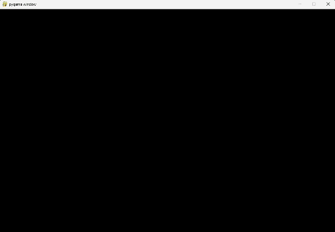

Mini proyecto que surge haciendo pruebas con el motor de PyGame.

Se generan multiples cuadrados en un frame que colisionan entre ellos cambiando el color de sus cuadrados adversarios hasta que solo queda un color.

---

Requisitos: PyGame.

Instalacion requisitos: pip install pygame

---

